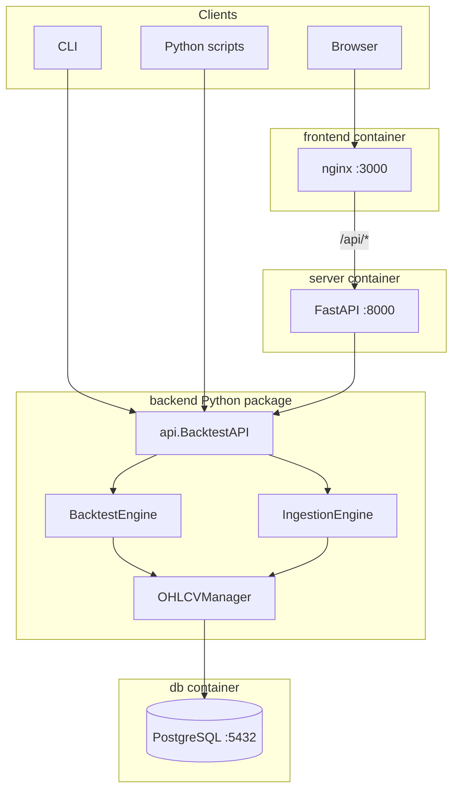

# Trading Analysis

A local stack for storing OHLCV market data in PostgreSQL, ingesting bars from Yahoo Finance, running multi-strategy backtests with fees and lookahead-safe fills, and exploring results via a Python API, HTTP API, CLI, or a React web UI.

## Features

- **PostgreSQL** – Single `ohlcv` table with unique `(symbol, timeframe, timestamp)` and indexed lookups.
- **Data manager** – Insert/upsert candles, query ranges, detect missing timestamps, track coverage.
- **Ingestion** – Pluggable `Ingester` interface; `YFinanceIngester` + `IngestionEngine` fetch only gaps for a requested range.
- **Backtesting** – `BacktestEngine` runs multiple named strategies; orders fill at the **next bar’s open** to avoid lookahead bias; commissions; equity curve and metrics (return, Sharpe, max drawdown).
- **Strategies** – `Strategy` ABC with `on_bar` / hooks; auto-discovery via `StrategyRegistry`; sample **RSI** and **Buy & Hold** baseline.
- **Python API** – [`backend/api/`](backend/api/) exposes `BacktestAPI` for programmatic runs, strategy listing, parameter metadata, and optional matplotlib charts.
- **HTTP API** – FastAPI in [`backend/server/`](backend/server/) for the web UI and any HTTP client.
- **Web UI** – React + Vite + Recharts in [`frontend/`](frontend/), served by nginx with `/api` proxied to the server.
- **CLI** – [`backend/backtesting/run_backtest.py`](backend/backtesting/run_backtest.py) with `--strategy`, dynamic strategy args, `--list-strategies`, `--no-fetch`, and auto-ingest by default.

## Architecture



## Project layout

| Path | Purpose |
|------|---------|
| [`docker-compose.yml`](docker-compose.yml) | `db`, `test`, `server`, `frontend` services |
| [`.env.example`](.env.example) | Copy to `.env` for Postgres and app DB settings |
| [`backend/db/`](backend/db/) | Connection pool, `OHLCVManager`, migrations (`init.sql`) |
| [`backend/ingestion/`](backend/ingestion/) | `Bar`, `Ingester`, `YFinanceIngester`, `IngestionEngine` |
| [`backend/backtesting/`](backend/backtesting/) | Engine, portfolio, results, chart, `Strategy`, registry, strategies, CLI |
| [`backend/api/`](backend/api/) | Public Python API: `BacktestAPI`, `StrategyInfo`, `StrategyParamInfo` |
| [`backend/server/`](backend/server/) | FastAPI app: `/api/strategies`, `/api/backtest` |
| [`frontend/`](frontend/) | React UI (strategy picker, params, charts, metrics) |

## Prerequisites

- [Docker](https://docs.docker.com/get-docker/) and Docker Compose v2
- Optional: Python 3.11+ if you run tests or scripts on the host (Docker is the supported path for tests)

## Quick start

1. **Environment**

   ```bash
   cp .env.example .env
   ```

   Adjust credentials in `.env` if needed. For containers, `DB_HOST` must be `db` (as in the example).

2. **Start database, API, and UI**

   ```bash
   docker compose up -d db server frontend
   ```

   - **Web UI:** http://localhost:3000  
   - **API (direct):** http://localhost:8000  
   - **OpenAPI docs:** http://localhost:8000/docs  

3. **Run tests** (requires healthy `db`)

   ```bash
   docker compose run --rm test
   ```

## Docker services

| Service | Port | Description |
|---------|------|-------------|
| `db` | 5432 | PostgreSQL 16 with persisted volume `trading_db_data` |
| `server` | 8000 | Uvicorn + FastAPI (`uvicorn server.main:app`) |
| `frontend` | 3000 | nginx static build; proxies `/api` → `server:8000` |
| `test` | — | One-shot pytest against mounted `./backend` |

The `server` service mounts `./backend` into `/app` so code changes apply after container restart (image still bundles dependencies from `requirements.txt`).

## Environment variables

Defined in `.env` (see [`.env.example`](.env.example)):

- `POSTGRES_USER`, `POSTGRES_PASSWORD`, `POSTGRES_DB` – Postgres bootstrap
- `DB_HOST`, `DB_PORT` – Used by the Python DB layer (`db` and `5432` inside Compose)

## HTTP API (FastAPI)

Base URL when using the UI: same origin (`/api/...`). Direct to server: `http://localhost:8000/api/...`.

| Method | Path | Description |
|--------|------|-------------|
| GET | `/api/strategies` | List selectable strategies with parameter metadata |
| GET | `/api/strategies/{name}` | Single strategy info |
| POST | `/api/backtest` | Run backtest; JSON body matches server schema (symbol, timeframe, dates, strategy name, `strategy_params`, capital, lookback, flags) |

Response includes per-strategy metrics, trades, and `equity_curve` as `[iso_timestamp, equity]` pairs for custom charting.

## Python API

From the `backend` directory (or with `PYTHONPATH` including `backend`):

```python
from api import BacktestAPI

names = BacktestAPI.list_strategies()
info = BacktestAPI.get_strategy_info("RSIStrategy")
strat = BacktestAPI.build_strategy("RSIStrategy", rsi_period=14, lower_bound=30, upper_bound=70, position_size=10)
results = BacktestAPI.run(
    symbol="SPY",
    timeframe="1day",
    start="2022-01-01",
    end="2023-01-01",
    strategies={"RSI": strat},
    include_benchmark=True,
)
# Optional matplotlib figure:
from backtesting.chart import plot_results
fig = plot_results(results, filename="out.png", show=False)
```

## CLI backtest

Inside the `test` container or a local env with deps and DB reachable:

```bash
docker compose run --rm test python -m backtesting.run_backtest --list-strategies
docker compose run --rm test python -m backtesting.run_backtest --strategy RSIStrategy --symbol SPY --start 2022-01-01 --end 2023-01-01
```

Use `--no-fetch` to skip automatic Yahoo ingestion.

## Adding a strategy

1. Add a module under [`backend/backtesting/strategies/`](backend/backtesting/strategies/) defining a class that subclasses `Strategy` from [`backtesting/strategy.py`](backend/backtesting/strategy.py).
2. Implement `on_bar` (and optionally `on_start` / `on_end`). Use typed `__init__` parameters for CLI and HTTP discovery.
3. No registry edits required: `StrategyRegistry` imports all modules in that package.

## Backtesting notes

- **Fills:** Orders submitted on bar *N* execute at bar *N+1* **open**.
- **Benchmark:** Buy & Hold is often added alongside the selected strategy for comparison (CLI and default API behavior).
- **Charts:** `plot_results` in [`backend/backtesting/chart.py`](backend/backtesting/chart.py) returns a matplotlib `Figure` when you need to save or customize plots.

## Tech stack

- **Backend:** Python 3.11, psycopg2, pandas, yfinance, matplotlib, FastAPI, uvicorn, pytest  
- **Frontend:** React 18, TypeScript, Vite, Recharts, nginx (Alpine)  
- **Database:** PostgreSQL 16  

## License

No license file is included by default; add one if you distribute the project.
